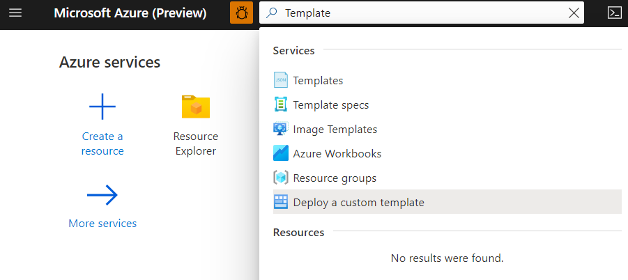
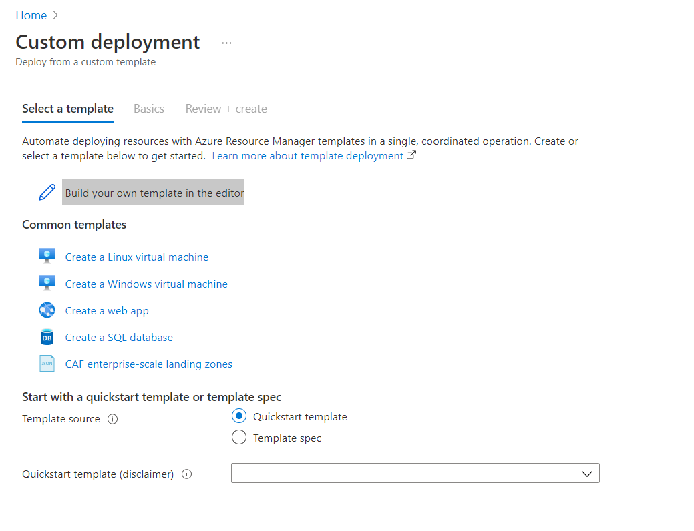
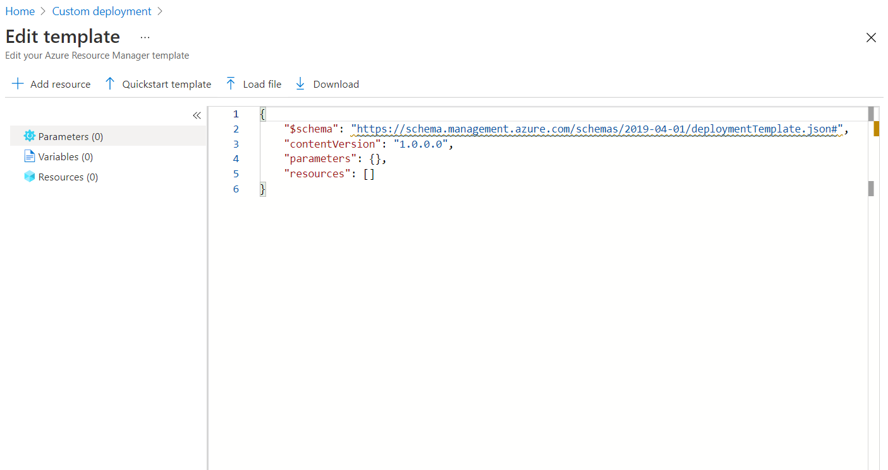
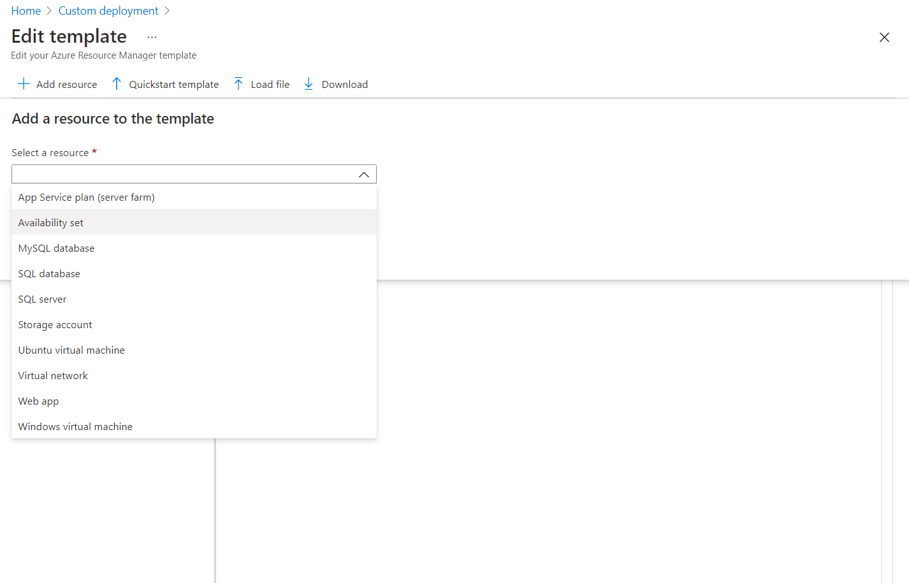
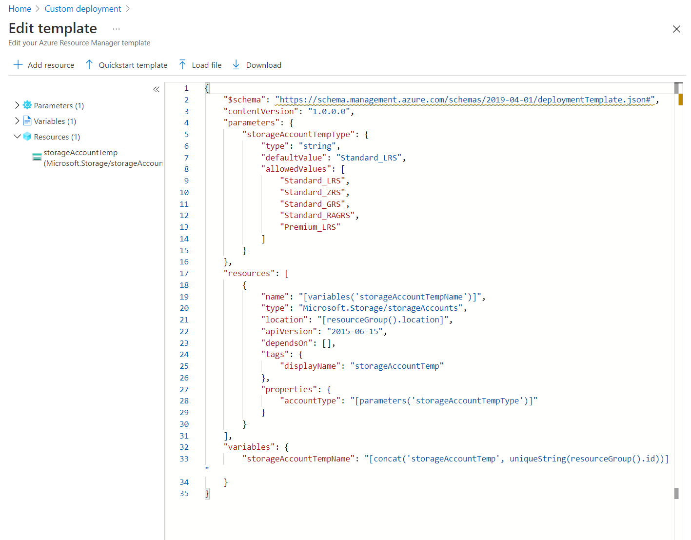
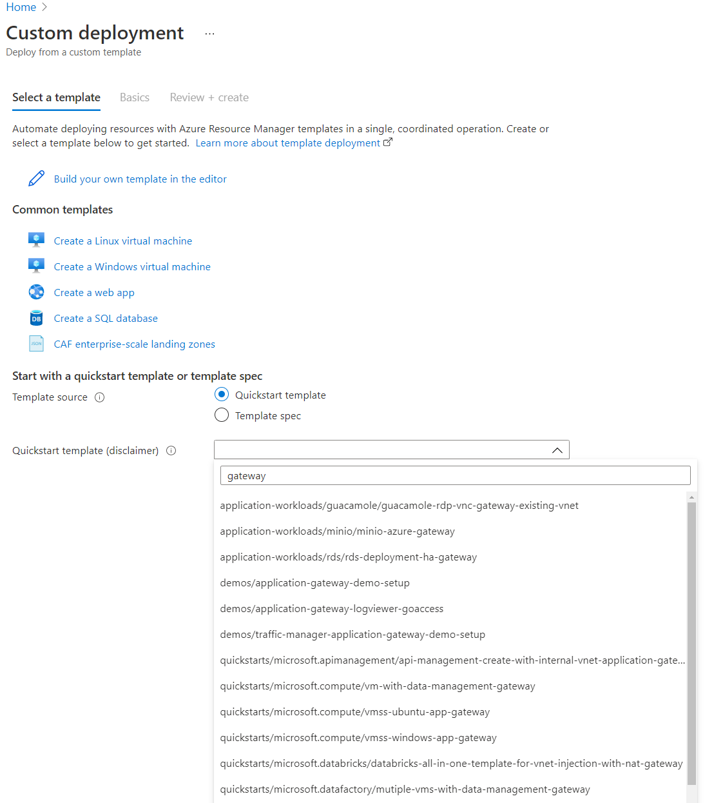

# ARM Templates

Export templates from existing resources
Use the wizard and download template

## Deploy custom template

In the dash board search for Template and select Deploy a Custom Template.


In Custom deployment click build Build your own template in the editor.


From here you can see the template json appear in the editor now we can add a resource.


Click on add resource and select a resource we can start with storage account for this example.


We can see the basic template for a storage account from here we can change the names to meet our need like `displayName` for example


We can also leverage the Github repo [azure-quickstart-templates](https://github.com/Azure/azure-quickstart-templates) directly from the Custom Deployment window by searching the type of template we need like `gateway` or `vm-simple-windows` and `vm-simple-linux` for example.



> Warning:
> This template was created by a member of the community and not by Microsoft. Each template is licensed to you under a license agreement by its owner, not Microsoft. Microsoft is not responsible for these templates and does not screen for security, compatibility, or performance. Community templates are not supported under any Microsoft support program or service, and are made available AS IS without warranty of any kind.

## Deploy

Visual Studio Code is the tool of choice when working on templates and deploying templates once we get a quickstart template we can export it and then edit and manage our templates all from [Visual Studio Code](https://code.visualstudio.com/).

To deploy our templates into Azure we can use the following command passing in the path to our template and it supporting `parameters.json` file.

You can run your commands from Visual Studio Code from the built in terminal window.

```Powershell
New-AzResourceGroupDeployment -ResourceGroupName RG-IaCSample `
    -TemplateFile ".\ImpInfraasCode\StorageAccount.json" `
    -TemplateParameterFile ".\ImpInfraasCode\StorageAccount.parameters.json"


```

You find some examples to start out with provided in the ImpInfraasCode folder.
